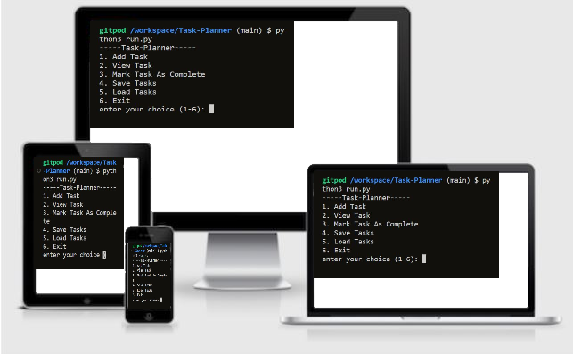
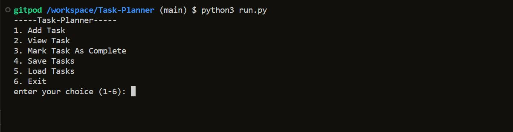
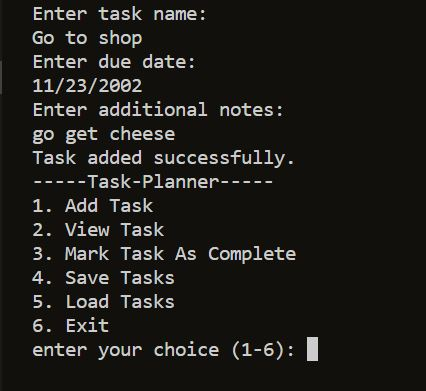
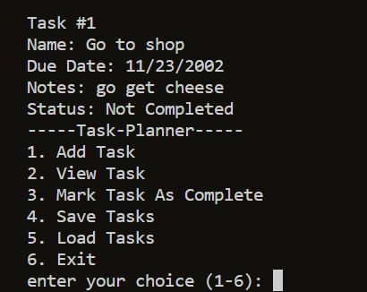
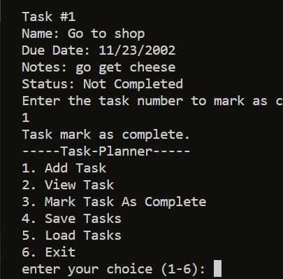
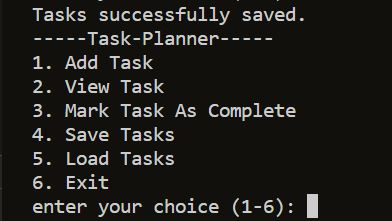
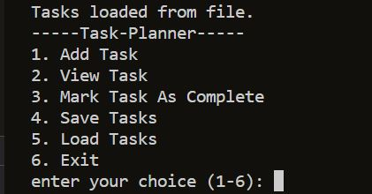
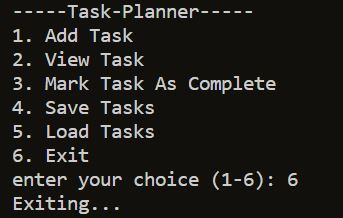

# Task-Planner
Task Planner is a python terminal application launched on Code Institute's mock terminal on Render.

This application provides the user with the ability to create and manage their tasks/ plans. The app provides a menu in the terminal in which the user can decide which action to proceed with and previous tasks can be saved to access them at a later date.

[Live link of application](https://task-planner-hfra.onrender.com)

## Features

### Menu 

- The menu presents the user with all the avaliable features of the application and prompts the user to choose the number of the option desired. The menu appears at the start of the application and after a action is finished.

### Add Task

- Option 1 allows the user to add a task/ plan. It prompts the user for a name, then a due date of this task, and finally give the option to add additional details regarding the task. 

### View Task

- Option 2 allows the user to view the task previously added and shows if the task is complete or not.

### Mark as complete

- Option 3 gives the user the ability to mark previously added tasks as complete. It prompts the user to select which numbered task to mark as complete

### Save Tasks

- Option 4 saves the previously added tasks into a json file to later be used.

### Load Tasks

- Option 5 is used to load tasks from the json file when coming back to using the application after exiting.

### Exiting

- Option 6 allows the user to leave the application loop. The tasks added and modified during the use of the app must be saved or else they will be deleted.

### Future Features

* A editing feature will be added to edit any part of added tasks and the status
* A clearing feature will be added to delete already completed tasks or unwanted tasks based on the users choice. This feature will prevent clutter for future use.

## Bugs

* No remaining bugs

## Validator Testing

- PEP8 Validator
    - No errors were found on PEP8 validator 

## Deployment

- Steps for deployment:
    - Go to [Render.com](https://render.com/)
    - Login with GitHub account
    - Create new deployment project
    - Select "link GitHub" and link all repositories
    - Select desired repositary
    - Set deployment settings to Europe region, main branch, python3 enviroment, and add instructed Port keys and Values
    - Click "create we service" button
    
## Credits

- The Code Institute has provided a terminal for the app to run as well as the template
- The Heroku website was used to deploy the application
- [w3schools](https://www.w3schools.com) was used a lot to find additional information and codes for a variety of problems encountered.

